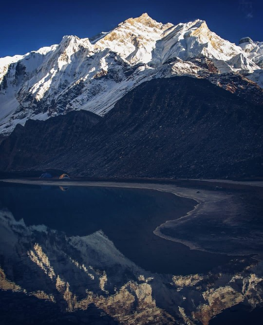
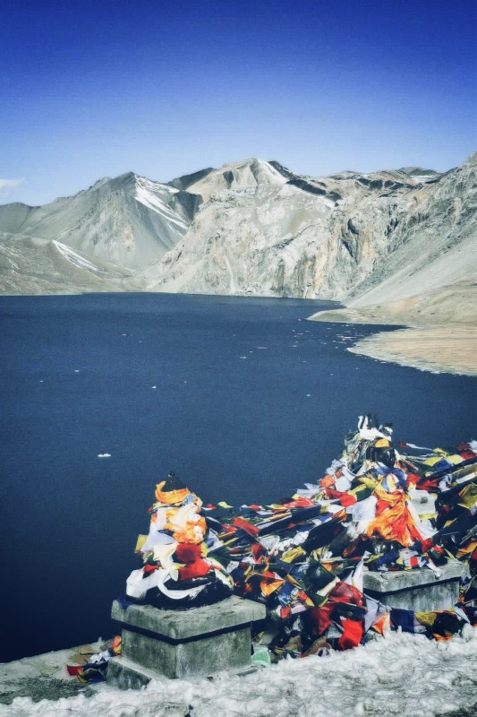

# roni-and-robin2
Roni and Robin's HW 1 Assignment for MMED 1054

My name is **Roni Soud!** and these are some fun facts about me!

### My Favourite Foods
- Pizza
- Cheesecake
- Rice
- Water
- Oregano
- Hot Dog

### My Least Favourite Foods
- Playstation
- Entropy
- Bicycle
- Alaska

### If I could adopt a pet monkey, this is a ranking of my 5 first picks:
1. Moople
2. Boyo
3. Stanko
4. Pluup
5. Cheese

### My Pet Dog!! 
[My Cute Doggy!](https://www.youtube.com/watch?v=dQw4w9WgXcQ)

## A picture I took in one of my favourite video games!

Hello, I'm Rabin Tamang. Welcome to my first github repostory homework. I am learing how to use github and the Visual Studio Code.So, I'm from Nepal. It is a beautiful country located in the south asia.This is my first time leaving my country and living in the different part of the world.I came to Canada on 11th, december for my study. I'm currently styuding Interactive Media Design at Fanshawe College, Downtown, London.I'm someone who values the quiet moments but I'm always energized by my love for music and sports. Traveling and exploring is my greatest passion, seeing new places and cultures keeps me inspired. And I love mountains.

### These are my favorite Music artist of all time
- Eminem
- kendrick Lamar
- Mac DeMarco
- Pink Floyd
- Radio Head
- Bob Marley

### These are my favorite Sports
- Football
- Cricket
- Basketball

### My Bucketlist of places to visit
- Japan 
- Switzerland 
- Iceland 
- Spain
 

So, these are the pictures I took last year when I trekked to Annapurna Base Camp (ABC) with my friends.

## Installation
No installation required
## Usage
Open in a browser of your choice
## Credits
Rabin Tamang and Roni Soud
## License
See lincense file 
